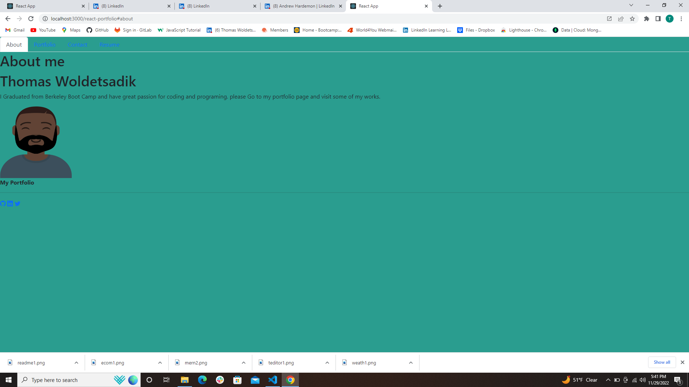
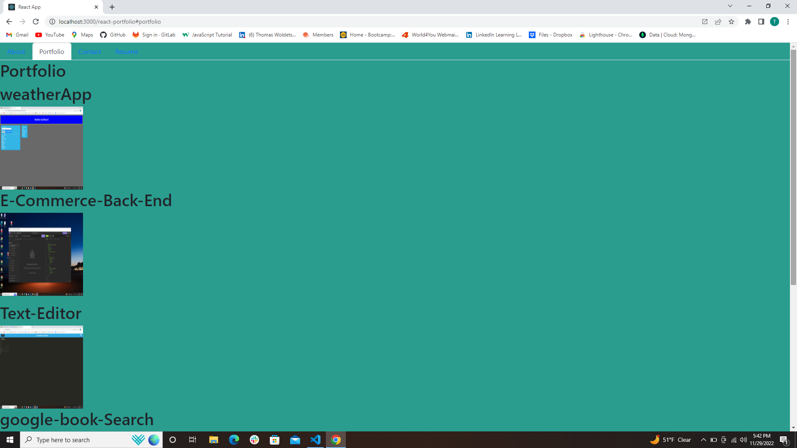
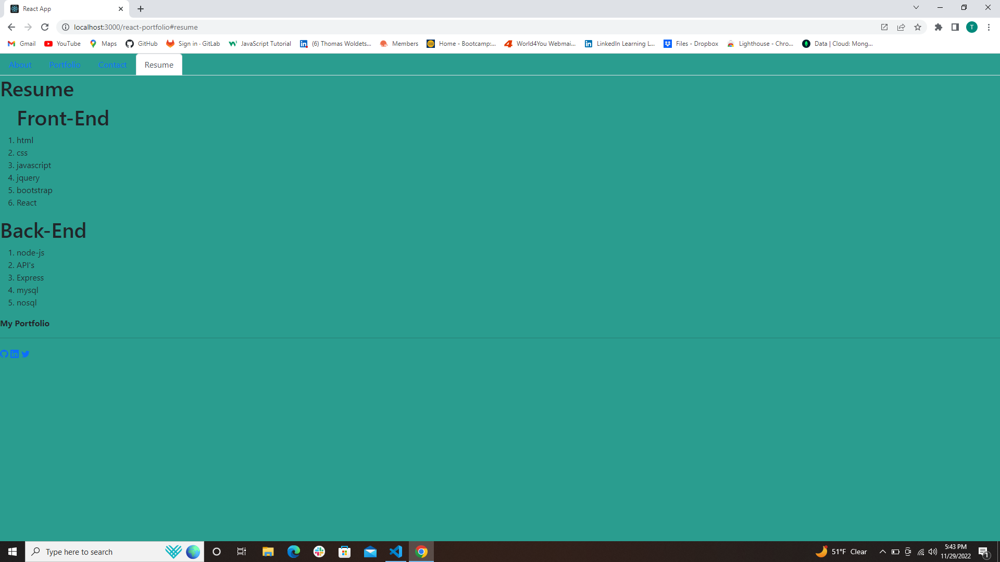

# React Portfolio

[Live Link]{();

## Description

a web developer needs a place not only to share a projects while applying for jobs or working as a freelancer but also to
share work with otherdevelopers and collaborate on projects.

This portfolio uses React , the latest technologies.

## Uses

An employer looking for candidates with experience building single-page applicationsto view a potential
employee's deployed React portfolio of work samplesso that the employer can assess whether they're a good
candidate for an open position

a single-page application portfolio for a web developer,when the user load the portfolio,then the user presented
with a page containing a header, a section for content, and a footer.when the user views the header,then the user
presented with the developer's name and navigation with titles corresponding to different sections of the portfolio.
when the user views the navigation titles,then the user presented with the titles About Me, Portfolio, Contact,
and Resume, and the title corresponding to the current section is highlighted.when the user click on a navigation title,
then the user presented with the corresponding section below the navigation without the page reloading and that title is
highlighted.when the user loads the portfolio the first time,then the About Me title and section are selected by default.
when the user presented with the About Me section,then the user see a recent photo or avatar of the developer and a short
bio about them.when the user presented with the Portfolio section,then the user sees titled images of six of the developer’s
applications with links to both the deployed applications and the corresponding GitHub repositories.when the user presented
with the Contact section,then the user sees a contact form with fields for a name, an email address, and a message.when
the user move the cursor out of one of the form fields without entering text,then the user receive a notification that
this field is required.when the user enter text into the email address field,thren the user receive a notification if
the user have entered an invalid email address.when the user presented with the Resume section,then the user sees a link
to a downloadable resume and a list of the developer’s proficiencies.when the user view the footer,then the user am presented
with text or icon links to the developer’s GitHub and LinkedIn profiles, and their profile on a third platform ( Twitter).
